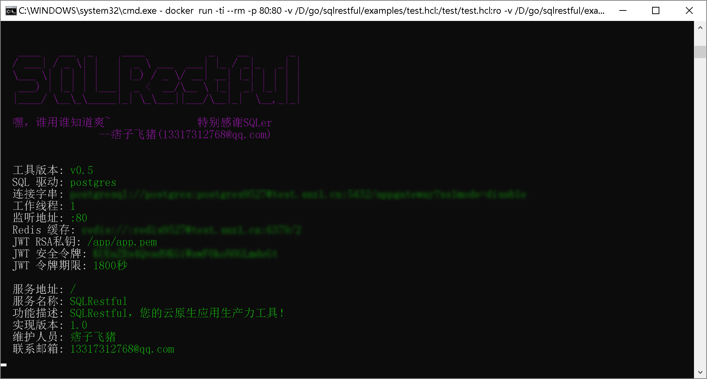

# SQL转Restful微服务接口开发工具

## 设计初衷

一直在使用`Java+SpringBoot`作为微服务生产力工具，通常来讲实现一个Restful微服务接口需要做以下相关工作：

  - ORM映射实现：通常使用MyBatis，需要写Pojo类、Mapper类和SQLProvider类。
  - 服务层实现：需要一个对象管理接口类与一个对象管理实现类。
  - 控制层实现：一个RestConfoller类并注解Rest方法再调用服务层实现。
  - Devops配置：Dockerfile、k8s部署描述文件等等。

这样一个`Restful`接口实现下来至少需要`5`个以上的类，大部分工作是在做转换、校验等语言相关的工作。

我们可以想想从SQL到Restful经历了多少层的实现，而大部分工作是毫无意义的规则代码。。。

> 您可能会建议我使用spring-cloud云原生开发框架，但一样也少不上述过程。

因此一直以来，我一直想要有一个工具可以直接把SQL转成Restful微服务接口，同时它必须是云原生的开发方式：

  - 1、配置化实现：通过简单的配置边可以很方便的实现SQL转Restful接口；
  - 2、执行效率高：不能因为配置和转换减低运行效率；
  - 3、可容器化部署：能方便打包成Docker镜像并运行；
  - 4、多数据库支持：包括oracle、db2、mysql、postgres、hadoop等。

通过此工具可以快速对外提供Restful规范的数据微服务接口，满足碎片化的数据服务需求应用场景的快速响应。

说干就干，于是我找到了[sqler](https://github.com/alash3al/sqler)，但是[sqler](https://github.com/alash3al/sqler)仅支持REST而不支持完整的Restful规范。

因此我在其基础之上实现了一个完整的SQL转Restful接口的服务工具，兼容[sqler](https://github.com/alash3al/sqler)配置语法的同时进行了Restful配置扩展实现。

感谢开源！

## 特色功能

 - [x] 使用`SQL`及`Javascript`实现完整的Restful微服务接口
 - [x] 内置`Swagger`接口文档界面（`Swagger2.0`支持）
 - [x] 为Restful微服务接口提供内置的`Redis`缓存配置。
 - [x] 配置脚本支持完整的`Javascript ECMAScript 5.1`规范
 - [x] 动态查询实现提供器支持不同参数的SQL实现分支
 - [x] 提供oci驱动支持Oracle数据库（参见【[数据库支持列表](docs/db.md)】）
 - [x] 消息接收与发送支持，包括stomp、amqp、kafka等协议
 - [x] 支持静态文件目录与静态文件独立映射
 - [x] 支持websocket消息服务定义实现
 - [x] 支持反向代理其他后台接口服务

## 快速入门

 - [`SQLRestful`开发入门示例](docs/start.md)
 - [`SQLRestful`开发及配置说明](docs/macros.md)
 - [`HCL`配置语言快速入门](docs/hcl.md)

## 开箱示例

```sh
docker run -ti --rm -p 80:80 snz1/sqlrestful \
  --name sqlrestful \
  -driver "sqlite3" \
  -dsn "/tmp/tmp.db?create=true" \
  -debug 3 \
  -swagger \
  -config "/examples/sqlite.hcl"
```

> 此时打开<http://127.0.0.1/doc.html>查看示例实现接口文档。

## 示例截图

<div text-align="center">

<h3>开箱即用的容器环境：<h3>

 <br>

<h3>查看接口文档：<h3>

 <br>

