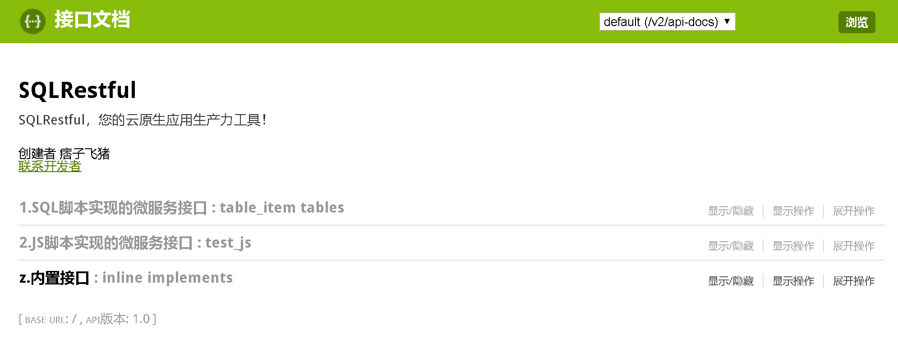

# `SQLRestful`开发入门示例


## 开发环境要求

 - `docker`
 - `notepad`或`vscode`或`editplus`
 - `curl`（可选）
 - `Linux`或`Windows`

## 准备`SQLRestful`脚本

使用如下命令创建一个`demo.hcl`文件：

```hcl
cat>demo.hcl<<EOF

//接口定义
//自动建表
_create_db {

  exec = <<SQL
    CREATE TABLE IF NOT EXISTS test (
        name    TEXT  PRIMARY KEY  NOT NULL,
        hello          TEXT    NOT NULL
    );
  SQL

}

//测试接口
test {

  //定义接口标签
  tags = ["1.示例接口"]

  //引入自动建表
  include = ["_create_db"]

  //定义接口地址
  path = "/test"

  //获取分页数据接口
  get {

    //概要描述
    desc = "获取分页数据"

    //绑定参数
    bind {
      offset = "$input.offset"
      limit = "$input.limit"
    }

    //返回记录总数
    total = <<SQL
      SELECT COUNT(*) FROM test;
    SQL

    //返回分页数据
    exec = <<SQL
      SELECT name, hello FROM test LIMIT :limit OFFSET :offset;
    SQL

  }

  //新增数据
  post {

    //概要描述
    desc = "新增数据"

    //参数绑定
    bind {
      name = "$input.name"
      hello = "$input.hello"
    }

    //插入数据库并返回插入记录
    exec = <<SQL
  
      INSERT OR REPLACE INTO test (name, hello) VALUES(:name, :hello);

      ---

      SELECT name, hello FROM test WHERE name = :name;

    SQL

    //返回对象
    result = "object"

  }

}


EOF
```

> 👉这里可以直接下载[demo.hcl](https://raw.githubusercontent.com/neeker/sqlrestful/master/examples/demo.hcl "点击鼠标右键打开新标签")文件👈。

## 运行`SQLRestful`开发的微服务

命令行执行以下`docker`命令运行示例脚本开发的微服务接口：

```bash
docker run -ti --rm -p 80:80 \
  -v /path/of/your_demo.hcl:/test/demo.hcl:ro \
  snz1/sqlrestful \
  -driver "sqlite3" \
  -dsn "/test/db.sqlite?create=true" \
  --swagger \
  -debug 3 \
  -config /test/demo.hcl \
```
 
 - `-p 80:80`前面那个`80`表示宿主机转发的端口
 - `/path/of/your_demo.hcl`为你创建的SQLRestful脚本文件

## 测试微服务接口

> 如果你使用远程主机运行SQLRestufl服务请把下面命令中的`127.0.0.1`替换成远程主机地址。

### 新增数据测试

* 命令行执行：

```bash
curl -X POST "http://127.0.0.1/test?name=hello&hello=world"
```

* 命令行返回：

```json
{"code":0,"data":{"hello":"world","name":"hello"},"message":"操作成功！"}
```

### 查询数据测试

* 命令行执行：

```bash
curl -X GET "http://127.0.0.1/test?limit=15
```

* 命令行返回：

```json
{"code":0,"data":{"data":[{"hello":"world","name":"hello"}],"offset":"0","total":1},"message":"操作成功！"}
```

## 通过swagger测试

新开标签并打开网址<http://127.0.0.1/swagger-ui.html>，如下图所示：



> SQlRestful提供了一个SwaggerUI界面用于测试实现的微服务接口，其默认是禁用的。<br>如果需要启用SwaggerUI界面请在启动命令中加上`-swagger`开关。


## 进一步了解

SQLRestful除了可以使用`sql`实现简单的微服务接口外，还可以配合`js`脚本实现复杂功能的，包括：

 - 内置多种数据库支持（参见【[数据库支持列表](docs/db.md)】）
 - 可通过`js`脚本实现可变条件的`SQL`查询；
 - 可通过`js`配置实现对请求参数的校验；
 - 可通过`js`实现`SQL`查询结果转换；
 - `js`脚本可请求其他接口并支持[`jwt`规范](https://snz1.cn/k8s/javadoc/appgateway/2.%E7%94%A8%E6%88%B7%E6%89%8B%E5%86%8C/CallApi.html)；
 - 为接口提供配置方式的`Redis`缓存实现；
 - 提供基于[用户统一安全认证服务](https://snz1.cn/k8s/javadoc/sc-client-api/)规范的权限验证配置

**使用建议**

☞ SQLRestful云原生开发工具是为了节省数据中台服务接口的开发成本！

☞ SQLRestful不能适用于复杂业务逻辑的应用场景，总之合适的才是最好的！

